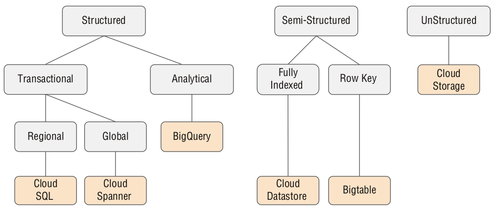

# Selection of the appropriate Storage Technology

Various critera to consider when chossing a storage technology

## Buisness Aspects

Different storage systems for different purposes, the choice is determined by the stage of the data lyfecycle:
- Ingestion : acquiring data & bringing it into the Cloud
- Storage : persisting data for later use
- Processing & analysis : transformation in a usable format & description
- Exploration & dataviz : making insights from tables / charts for others/ decision

1. Ingestion

    1. Application Data
        - Generated by Mobile / Web (backend services) / Software apps
        - Examples : Transactions from an online retail app. Clickstream from users reading articles on a web site. Logs from a software. User registration from an online service.
        - The volume of data depends on the number of users (can vary widely)
    2. Streaming Data
        - Sent in small messages transmitted continuously from the source
        - Event time including a time stamp : need to be ordered (insertion in the correct position requires buffering ) for processing --> time series analysis
        - Examples : VMs monitoring data, IoT devices / Sensors, Customers adding items to an online shopping cart...
    3. Batch Data
        - In bulk, typically in files uploaded.
        - Examples : transaction data, archives, migration from on premises
        - Cloud storage is typically used for batch uploads, eventually in conjunction with Cloud Transfer Service and Transfer Appliance for large volumes.

2. Storage
    1. How data is accessed : for instance, online transaction (query for specific records using a set of filters) vs a ML pipeline (training with thousand rows ie in batch mode) 
    2. Access constrols :
        - Fine grained : implemented at the app level or by creating views that limit the data available to some users
        - Coarse grained : based on bucket permissions & access contro lists on objects stored in a bucket
    3. How long data will be stored :
        - if transient : could be stored on SSD (lost when instance shut down)
        - if frequently used : well suited in either relational or NoSQL db
        - policies to migrate older data to nearline (used once a month) or coldline (used once a year), with age can be deleted (if compliant with regulations) or archived 

3. Processing & analysis
    1. Transformation
        - Map into forms that make the data readily available to ad-hoc queries / analytics
        - Cleansing, correcting errors according to the data type or buisness logic (depends on the use case), normalizing / standardizing data --> Cloud Dataflow
    2. Analysis
        - Extract usefull infos with statistical techniques
        - Description, characteristics, correlations, predictions, cluster subsets... --> Cloud Dataflow, Cloud Dataproc, BigQuery & Cloud ML Engine
4. Exploration & dataviz (Cloud Datalab / Data Studio    

## Technical Aspects

1. Volume
2. Velocity : 
    - the rate at which it is produced, sent & processed
    - during ingestion, I/Os, it is important to match the velocity of incoming data with the rate at which the data store can write/read data
    - Web & mobile apps (human entered data): typically low velocity
    - IoT & time series (machine generated data): high velocity
3. Variation of structure
4. Data access patterns
    - How much data is retrieved / written in a read / insert operation
    - How often data is read / written

## Variation in data structure

1. Structured = a fixed set of attributes -> 
    columns = attributes / rows = records or entities
    - OLTP : many operations one row at a time each (Cloud SQL & Cloud Spanner)
    - OLAP (data warehousing) : the analyst would query many rows and only some columns (BigQuery uses a column oriented approach)
2. Semi-structured = doesn't follow a fixed tabular format and instead stores schema attributes along with the data (set of attributes can vary from one instance to another). Allow users to add attributes without changing the schema
    - Fully indexed : ffffffffffffffffffffffff
    - Row-key access : fffffffffffffffffffffffffff
3. Unstructured = doesn't have a defined schema or data model & may have an internal structure that is not relevant to the way it is stored.

    

-   | Structured        | Semi-structured           | Unstructured  |
----| ------------- |:-------------:| -----:|
schema  | fixed      |  attributes can vary | no defined |
flexibiity   | low      | goog compromise      |   high |
scalibity   | difficult | feasible      |    easy |
examples   | tables | fffff      |    text (NLP), audio, video files, binary large objects (BLOBs) |

## Decision tree
    

## Schemas for relational & NoSQL db

